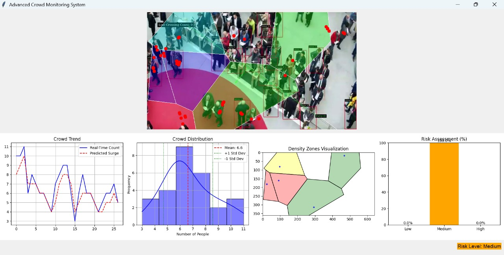

# Smart Crowd Monitoring and Choke Point Prevention System

---

## Project Overview

This project started with a simple goal: **detect the number of people in a store and alert if the number exceeds a threshold**.

Through brainstorming and discussion, we evolved it into a **substantial, real-world system** that can:

1. Monitor crowd density in real time  
2. Predict the possibility of stampedes  
3. Identify and prevent choke points  
4. Provide actionable, visual outputs for authorities  

The final system is called the **Smart Crowd Monitoring and Choke Point Prevention System**, designed to enhance public safety through **video analysis, intelligent clustering, graph-theoretic insights, and dynamic visualizations**.

---

## Key Features

* **YOLOv8n People Detection** – Real-time people detection using a pre-trained YOLOv8n model.  
* **Surge Prediction** – Uses **Weighted Moving Average (WMA)** to predict upcoming surges in crowd density.  
* **Fuzzy Risk Classification** – Employs **fuzzy set theory** to dynamically classify risk levels without hardcoded thresholds.  
* **Graph-based Choke Point Detection** –  
  * Uses **graph isomorphism** to compare crowd layouts to known risky patterns.  
  * Detects **articulation points** to identify critical individuals or clusters that could cause bottlenecks.  
* **Anomaly Detection** – Applies **z-score analysis** to flag unusual crowd behaviors or density spikes.  
* **Safer Zone Visualization** –  
  * Uses **DBSCAN clustering** and overlays it onto **Voronoi diagrams** to highlight safer, lower-density areas.  

---

## Technologies Used

**Computer Vision** – YOLOv8n (Ultralytics)  
**Clustering & Graph Analysis** – DBSCAN, graph isomorphism, articulation point detection  
**Mathematical Modeling** – Fuzzy set theory, Weighted Moving Average, z-score, Poisson distribution *(future scope)*  
**Visualization** – Voronoi diagrams, real-time color-coded risk maps  
**Frontend/UI** – Managed by **Tanish Bhongade** using modern UI design practices  
**Backend/Server** – Deployed using **AWS services** for scalability  

---

## Future Scope

Escape route visualization using **A\*** or **Dijkstra** algorithms  
Automating people flow predictions with **Poisson distribution** alongside WMA  
More user-friendly and interpretable anomaly detection outputs  
Optimizing bandwidth for efficient **real-time processing**  

---

## System Visualization

  

> *Above: An overview of the Smart Crowd Monitoring System — integrating detection, clustering, analysis, and visualization.*

---
<!--
## Team

**Upanishad Kachroo** – Core Algorithm Design & Backend Logic  
**Tanish Bhongade** – Frontend/UI Design  
**Pruthviraj & Team** – Integration & Testing  
**Guide** – *D. B. Kilkarni Sir*  

---

*“Preventing chaos before it happens — because every crowd deserves safety.”* 
-->
